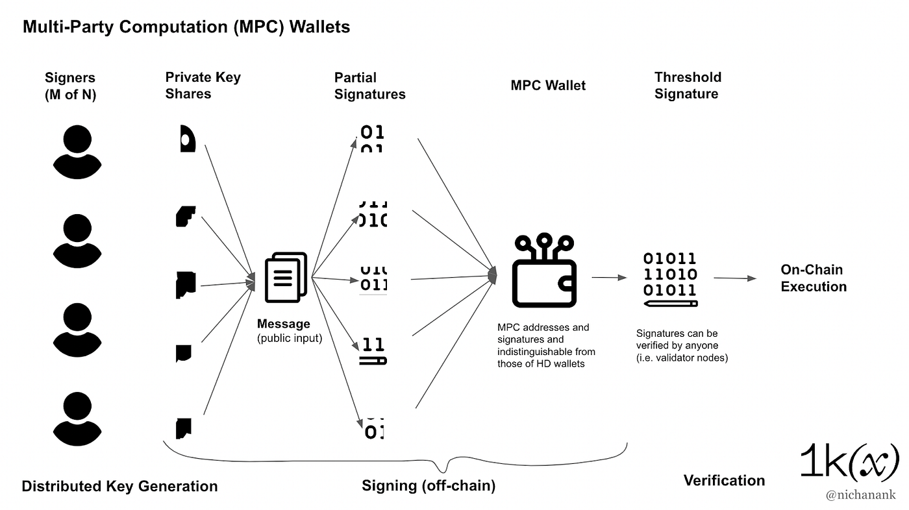

# Account Abstraction x Lit MPC

Lit leverages [multi-party computation (MPC)](https://www.wikiwand.com/en/Secure_multi-party_computation?ref=spark.litprotocol.com) to provide a distributed key management system that enables secure reading and writing of data between blockchains and off-chain platforms. With the added benefits of encryption, access control, and programmatic signing, Lit enhances the capabilities of what’s possible with account abstraction.

Section Overview

- Use cases of account abstraction with Lit
- An intro to account abstraction and multiparty computation (MPC)
- How to use Lit Actions & Programmable Key Pairs (PKPs) to work with AA

## How to use Lit with Account Abstraction (AA)

1. Adding a Programmable Key Pair (PKP) as a signer to an AA wallet.
2. User Onboarding - creating a smart contract account for someone new to web3. The signer can start as an multi party computation (MPC) key authorized through a web2 account.
3. AA wallet authorization for a PKP - smart contract accounts with signing capabilities through PKPs.
4. Non-ECDSA AA wallet with a PKP wallet - allowing freedom of signature verification scheme.
5. Conditional gas payments - PKP wallet pays for gas fees when certain conditions are met.

### The technology that makes Lit x AA possible

In order to utilize account abstraction systems with Lit, there are two main concepts to understand: Programmable Key Pair (a public private key pair stored across the Lit nodes) and Lit Actions, JavaScript functions that specify the conditionals of signing. 

Lit Actions are JavaScript functions that can communicate data across blockchains, interoperate between previously disconnected ecosystems, and use off-chain data sources in their computation by making arbitrary [HTTP requests](../sdk/wallets/intro.md).

Lit Actions are used in conjunction with Programmable Key Pairs (PKPs) to give signing capabilities. Each PKP is generated collectively by the Lit network in a process called [Distributed Key Generation](https://en.wikipedia.org/wiki/Distributed_key_generation?ref=spark.litprotocol.com) (DKG) whereby each node only holds a **share** of the underlying private key (a key-share) and the complete private key **never exists in its entirety**.

To create this distributed key pair, you must mint it in the form of an ERC-721 NFT. The NFT stands as the “symbol” or method for controlling the distributed key custodied by the Lit network. This means that only the **wallet address or smart contract holding the PKP NFT** can authorize how it is used for signing.

PKP signatures are the validation result of Lit Actions code when using a signature to *prove* that a particular interaction took place. Lit Actions can validate the information from external sources, such as from a Weather API, or data that is stateless such as checking if a number is prime.

Ideal cases for PKPs and Lit Actions

- Generating proofs are ideal for usage with AA wallets, essentially this is programmable transaction validation through Lit’s network with a signer
- Looking up permitted actions, addresses, and [auth methods](../sdk/authentication/overview.md) associated with a PKP
- Checking access control conditions with [conditional signing](../sdk/serverless-signing/conditional-signing.md)

## A Brief Account Abstraction (AA) Intro

Account abstraction references [EIP-4337](https://eip4337.com/en/latest/index.html?ref=spark.litprotocol.com). AA shifts the validation of transactions from the Ethereum protocol to the smart contract level with a specific [entry point](https://ethereum-magicians.org/t/erc-4337-account-abstraction-via-entry-point-contract-specification/7160/1?ref=spark.litprotocol.com). With it are abstractions for a user's account, standardized smart contract account interfaces, and gas abstraction. This is possible by separating the transaction's signature from the account address, allowing for possibilities like switching between different accounts in a single transaction. 

EIP-4337 sets a standard interface for everyone to work with when creating smart contract accounts.

How AA enhances user experience:

- Programmed security - The requirement of additional confirmations in the event of fraud detection such as two-factor authentication, additional signing with a web3 wallet, or confirmation through another smart contract.
- Social Recovery - In [What is a Social Recovery Wallet](https://hackernoon.com/what-is-a-social-recovery-wallet?ref=spark.litprotocol.com) by Vitalik Buterin, he writes a good wallet design needs to satisfy three key criteria: no single point of failure, low mental overhead, and maximum ease of transacting. Social recovery can look like a multi-signature transaction to approve changing a signing key if an account has been compromised or lost.

## Multi party computation (MPC)

MPC enables multiple parties – each holding private data – to evaluate a computation without ever revealing any of the private data held by each party (or any otherwise related secret information). 

An MPC wallet is a wallet whose public private key is divided and shared among multiple parties, in Lit’s case the key is stored across the Lit nodes and only authorized parties can recombine the key shares to generate a signing key.

Two strengths of Lit powered MPC wallets

- allows for authorization processes to occur outside of the blockchain, the underlying key generation and signing rely on cryptography off-chain
- can work with various blockchain networks that utilize elliptic curve signatures, including but not limited to Bitcoin. Expanding compatibility to additional blockchains lies in the capability to produce signatures the networks can decipher

## Continue learning
Read more: https://spark.litprotocol.com/account-abstraction-and-mpc/

Ready to check out some code?

[Check out this guide on how to integrate Pimlico with Lit OTP Authentication](https://docs.pimlico.io/how-to/integrations/lit-protocol)
Pimlico is an infrastructure platform for building the next generation of Smart Wallets. If you are developing an ERC-4337 Smart Wallet, they provide bundlers, verifying paymasters, ERC-20 paymasters, and much more to help you build and iterate on wallets.

This how-to guide will walk you through the steps to integrate Lit Protocol's OTP sign-in with email, SMS, and Whatsapp with a smart account whose user operations are relayed and sponsored by Pimlico.