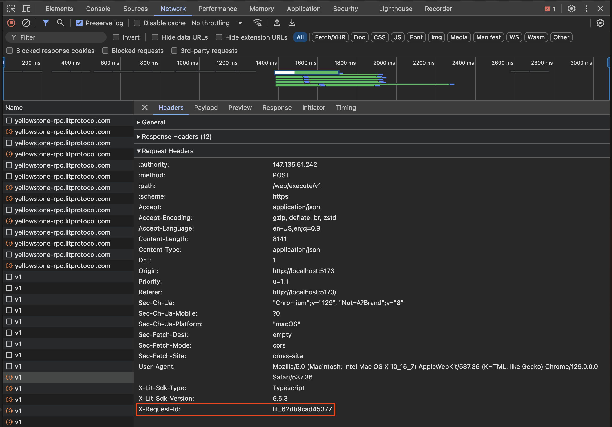

# Connecting to Lit

The `LitNodeClient` is used to connect your session to the Lit network. After initializing a `LitNodeClient` instance, you can use the `connect()` method to establish a connection.

When initializing a `LitNodeClient` instance, you must provide a `litNetwork`.

```tsx
import { LitNodeClient } from '@lit-protocol/lit-node-client';
import { LitNetwork } from '@lit-protocol/constants';

const litNodeClient = new LitNodeClient({
  litNetwork: LitNetwork.DatilDev,
  debug: false,
});

await litNodeClient.connect();
```

### `LitNetwork` Constant

The `LitNetwork` constant contains the past and present Lit networks. The constant is imported from the `@lit-protocol/constants` package. The current networks in the constant can be found [here](https://v6-api-doc-lit-js-sdk.vercel.app/enums/constants_src.LitNetwork.html).

### `LitNodeClient` Flags

You have the option to pass flags to the `LitNodeClient` instance. These flags are used to configure the Lit network connection. You can find a complete list of flags in the [LitNodeClient Config](https://v6-api-doc-lit-js-sdk.vercel.app/interfaces/types_src.LitNodeClientConfig.html). In this guide we will cover the most common flags: `debug` and `storageProvider`.

#### `debug`

The `debug` flag is used to enable or disable debug logging. When enabled, debug logs will be written to the console. This flag will only provide debug logs when executing in a Node.js environment. In a browser environment, the `debug` flag will be ignored.

#### `storageProvider`

The `storageProvider` flag is used to configure the storage provider used by the Lit network. When provided, the Session Keypair will be stored in the provided storage.

If not provided, a new Session Keypair will be generated each time the `LitNodeClient` is initialized.

In a browser environment, the `storageProvider` flag will be ignored, and the Session Keypair will be stored in the browser's local storage. To clear the cached Session Keypair, you can use the `disconnectWeb3` function (imported from the `@lit-protocol/auth-browser` package) like so:

```ts
import { LitNodeClient } from '@lit-protocol/lit-node-client';
import { LitNetwork } from '@lit-protocol/constants';
import { disconnectWeb3 } from "@lit-protocol/auth-browser";

let litNodeClient;
try {
  litNodeClient = new LitNodeClient({
      litNetwork: LitNetwork.DatilDev,
      debug: false,
  });

  await litNodeClient.connect();
} catch (error) {
  // handle errors
} finally {
  disconnectWeb3(); // <--- When this function call is executed,
                    // the Session Keypair will be deleted from the browser's local storage
  litNodeClient.disconnect(); // <--- Here we disconnect from the Lit network
}
```

### Disconnecting from the Lit Network

To disconnect from the Lit network, you can use the `disconnect()` method on the `LitNodeClient` instance (as shown in the example above). This detaches Lit's listeners for contract changes and stops network polling.

### Additional Support

If you encounter any issues, providing the Lit team with your Lit request ID can help us resolve the problem faster.

#### Node.js Environment

In a Node.js environment, the request ID will be logged to the console when an error occurs. If this is not the case, you can enable debug logging by setting the `debug` flag to `true` in the `LitNodeClient` instance; the request ID will then be logged to the console.

The following is an example log from `LitNodeClient` when `debug` was set to `true`:

```
[Lit-JS-SDK v6.8.1] [2024-10-12T02:45:37.100Z] [DEBUG] [core] [id: a1eefc564ff6b] executeJs responseData from node
```

`[id: a1eefc564ff6b]` is the Lit request ID that you should provide to the Lit team when making a support request.

#### Browser Environment

In a browser environment, the request ID will be logged to the console when an error occurs. If not, you can find the error in the **Network** tab of your browser's developer tools; scrolling to the bottom of the page will show the request ID.

The following is an example of a response to a request made using `LitNodeClient` in the browser:



`lit_62db9cad45377` is the Lit request ID that you should provide to the Lit team when making a support request.

### API Reference

To learn more about `LitNodeClient` properties and methods, visit the [API Reference Docs](https://v6-api-doc-lit-js-sdk.vercel.app/classes/core_src.LitCore.html).

### Code Example

A short code example of connecting to the Lit network with a `LitNodeClient` instance can be found in our developer guides repo [here](https://github.com/LIT-Protocol/developer-guides-code/tree/master/starter-guides). There are examples for both Node.js and the browser.