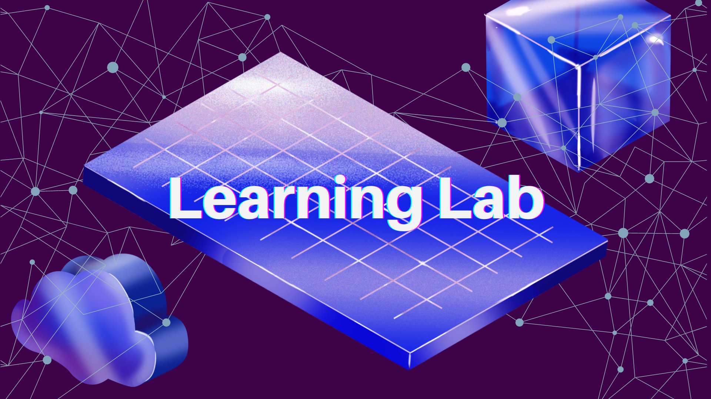

import IntroSection from '../../src/components/LLCardSections/Intro';
import CodebreakerSection from '../../src/components/LLCardSections/Codebreaker';
import EcosystemSection from '../../src/components/CardSections/Ecosystem';

# Introduction to the Learning Lab

Welcome to Lit Protocol's Learning Lab! Our curriculum has been designed to empower you with the necessary skills and expertise to excel in building and implementing decentralized access control and programmatic signing. Additionally, by completing each module, you'll have the opportunity to earn exclusive NFTs, demonstrating your expertise in the subject matter.

Whether you're a curious beginner or an experienced professional aiming to stay at the forefront of this field, the lessons cater to individuals of all proficiency levels. 

You can commence your learning journey by starting with the fundamentals and progressively advancing, or you can directly explore the more complex concepts, pushing the boundaries of your understanding to reach new heights.

Embark on your Lit adventure today!

<IntroSection title="Intro"></IntroSection>

<CodebreakerSection title="Codebreaker Challenges"></CodebreakerSection>

<EcosystemSection title="Join the Lit Ecosystem"></EcosystemSection>