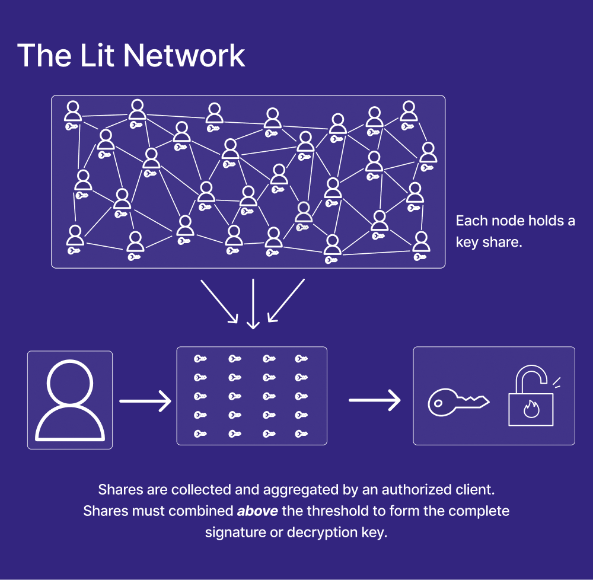

# 2. The Lit Network

The Lit network operates through a distributed federation of nodes, where each node plays a vital role in key generation, consensus, and the execution of Lit Actions. What sets Lit apart is its foundation on threshold cryptography. With this approach, Lit ensures that no single node possesses complete control or executive authority over the network. This decentralized structure guarantees enhanced security, resilience, and trustworthiness for all participants in the Lit ecosystem.

---

## Objectives
At completion of this reading you should be able to:

- Explain how the Lit network uses threshold cryptgraphy.

---

## Threshold Cryptography
Threshold cryptography, in the context of Lit, is employed to generate shares of a new public/private key pair, a process known as Distributed Key Generation (DKG). Unlike traditional cryptography, the private key of this pair never exists in its entirety. Instead, each node within the network holds a unique private key share.

These private key shares function similarly to a regular private key, enabling nodes to perform cryptographic operations such as signing and decryption. However, here's the key difference: to obtain the final signature or decrypted content, a combination of signature or decryption shares from multiple nodes, above a pre-defined threshold, is required.

Currently, the threshold is set to two-thirds, meaning that if there are 100 nodes in the Lit network, you would need to gather decryption or signature shares from at least 67 nodes. Consequently, a single private key share is insufficient on its own, and the ownership of the private key is decentralized across the participating nodes.

Importantly, all cryptographic operations take place within a secure, black-box environment. This ensures that node operators and external agents have no access to the private key shares contained within. In user-facing operations, such as the provisioning of shares for signing and decryption, nodes communicate with each user through independent and encrypted channels. Consequently, shares are only exposed client-side at the precise moment of recombination, maintaining a high level of security.

## Conclusion
By employing threshold cryptography within the Lit network, power resides in the collective participation and collaboration of nodes, ensuring the network's security and integrity. No single node has complete control.

As you delve deeper into the world of cryptography, understanding threshold cryptography's role in Lit's infrastructure will enhance your grasp of decentralized systems and their applications in real-world scenarios.
