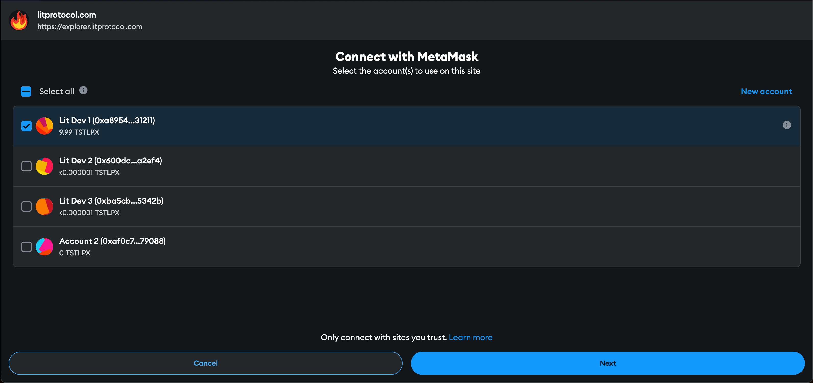
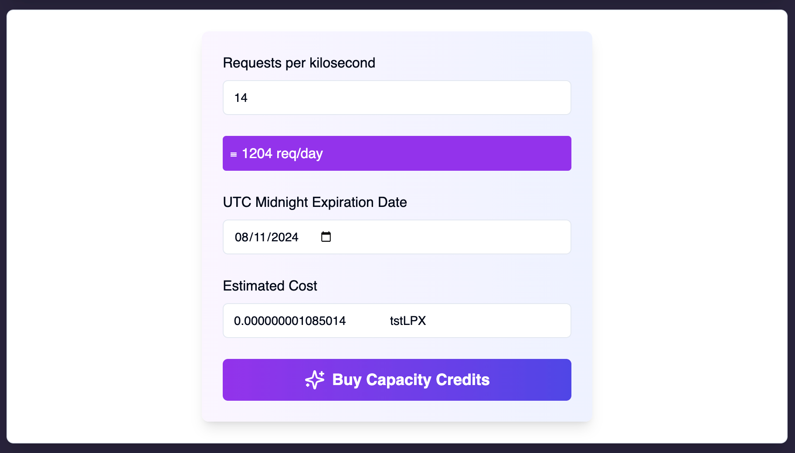
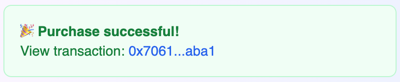

# Via the Lit Explorer

Capacity Credits can be minted using the [Lit Explorer](https://explorer.litprotocol.com/) dApp. The following guide will demonstrate how to mint a new Capacity Credit.

:::info
To learn more about what a Capacity Credit is, and how they're used, please go [here](../capacity-credit-intro.md).
:::

## Prerequisites

Before continuing, you'll need access to an Ethereum wallet that has [Lit test tokens](../../connecting-to-a-lit-network/lit-blockchains/chronicle-yellowstone.md#tstlpx-test-token) on the Chronicle Yellowstone blockchain. If you don't already have tokens, you can request some using [the faucet](https://chronicle-yellowstone-faucet.getlit.dev/). The `tstLPX` test token will be sent to your wallet address, allowing you to perform transactions on the rollup.

You'll also need to add the Chronicle Yellowstone [chain facts](../../connecting-to-a-lit-network/lit-blockchains/chronicle-yellowstone.md#connecting-to-chronicle-yellowstone) to your wallet, so that you can send transaction to the network.

## Setup

1. Navigate to the [Lit Explorer](https://explorer.litprotocol.com/) dApp.

2. Connect your wallet to the explorer by clicking the `Connect Wallet` button.

3. Select the Lit network you'd like to mint the Capacity Credit for.

This is done using the network dropdown next to the previously clicked `Connect Wallet` button. By default, the `Datil` network is selected - the Datil network is the decentralized mainnet beta Lit network. For an overview of the available Lit networks, go [here](../../connecting-to-a-lit-network/connecting.md).

For this guide, we're going to select the `DatilTest` network:

## Minting a Capacity Credit

The following UI is how we'll mint a new Capacity Credit:

### Requests Per Kilosecond

This parameter is the capacity you're reserving on the Lit network measured in requests per kilosecond. This value is the maximum number of requests your Capacity Credit can be used for in a given day. Once your credit has been used for this number of requests, you will receive a Rate Limit error if it's used again before midnight UTC time.

For convenience, the number inputted is converted to the number of requests per day. By default, this value is set to `14` requests per kilosecond which is also `1,204` request per day.

### UTC Midnight Expiration Date

This parameter sets the date the Capacity Credit will expire. The credit expires at 12:00 AM (midnight) Coordinated Universal Time (UTC) on the specified date.

:::note
The actual expiration time in your local timezone may be different due to the UTC conversion. For example, if you're in New York (ET), a credit set to expire on June 1st will actually expire on May 31st at 8:00 PM ET.
:::

### Estimated Cost

This is the estimated cost, in Lit test tokens, to mint the Capacity Credit with the parameters you have selected.

:::note
Important considerations:

- The estimated cost does not include the gas fee for the transaction.
- The actual cost may fluctuate depending on network usage:
    - It may increase as more users reserve network capacity.
    - It may decrease as previously reserved network capacity expires.
:::

### Buying the Credit

After selecting your credit parameters, click the `Buy Capacity Credits` button to create the transaction to the Chronicle Yellowstone blockchain to purchase your credit.

You should be prompted by your Ethereum wallet to sign and submit the transaction to the blockchain:

After signing and submitting the transaction to the network, you will receive a confirmation notification similar to:

You can click the transaction hash in the notification to be taken to the Lit block explorer to view the transaction details.

### Getting the Credit Info

In order to use your new Capacity Credit to pay for the usage of the Lit network, you need to know the *Token ID* of the credit. You find this for the new credit, as well as all other credits minted by your account, by navigating the the [Profile](https://explorer.litprotocol.com/profile) page.

On this page you will see all of the PKPs and RLI (Capacity Credit) tokens that are associated with your account.

In the `Your RLI Tokens` table, you will see the info for the Capacity Credit you just minted. The `Token ID` (in the screenshot that's `751`) is the identifier for your credit, and the value you will use when when making requests to the Lit network.

## Summary

After following the above guide, you will have minted a new Capacity Credit that can be used to pay for usage of the Lit network. To learn more about how to use this credit for payment, please go [here](../delegating-credit.md).