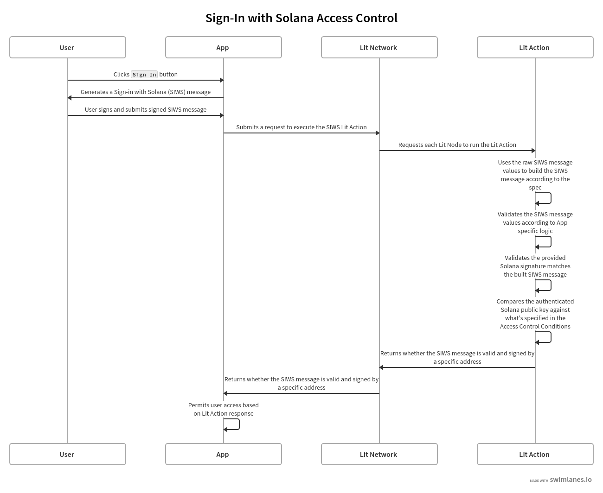

# Sign-in With Solana Access Control

This guide builds on the [Sign-in With Solana Authentication](../../authentication/authenticating-siws.md) guide to show how to use Lit Actions to implement access control for Solana wallets authenticated using SIWS.

We combine the SIWS authentication with Lit Access Control Conditions to demonstrate how to control access to to an app based on the user's Solana public key.

## Prerequisites

Before continuing with this guide, make sure you have the following:

- An understanding of [Lit Actions](../../serverless-signing/overview) and how they work
- An understanding of how to [authenticate SIWS messages](../../authentication/authenticating-siws) using a Lit Action
- A basic understanding of Phantom's [SIWS specification](https://github.com/phantom/sign-in-with-solana/tree/main)
- An understanding of [Lit Access Control Conditions](../../../sdk/access-control/evm/basic-examples)

## High Level Overview

The following diagram depicts the flow of authenticating SIWS messages and then using the authenticated public key to check against Lit Access Control Conditions:



:::info
A full implementation of this code example can be found [here](https://github.com/LIT-Protocol/developer-guides-code/tree/master/siws-accs/browser).
:::

## Writing the Lit Action

The Lit Action used for this example does the following:

1. Parses the raw SIWS message values
2. Builds the SIWS message according to the SIWS specification
3. Validates that the provided Solana signature is valid for the SIWS message
4. Compares the derived public key against the public key specified in the Lit Access Control Conditions
5. Returns the result of the comparison

For steps 1 - 3, we reuse the SIWS authentication logic from the [SIWS Authentication](../../authentication/authenticating-siws#parsing-and-re-building-the-siws-message) guide, so this guide will pick up from step 4.

:::info
The full implementation of this Lit Action can be found [here](https://github.com/LIT-Protocol/developer-guides-code/blob/master/siws-accs/browser/src/litActionSiws.ts).
:::

### Checking the Access Control Conditions

At this point we have validated that the provided user signature is for the SIWS message, constructed according to the SIWS specification. Now we need to check the user's Solana public key against the public key specified in the Lit Access Control Conditions:

```js
try {
  const result = await LitActions.checkConditions({
    conditions: solRpcConditions,
    authSig: {
      sig: ethers.utils
        .hexlify(ethers.utils.base58.decode(_siwsObject.signature))
        .slice(2),
      derivedVia: "solana.signMessage",
      signedMessage: siwsMessage,
      address: siwsInput.address,
    },
    chain: "solana",
  });

  return LitActions.setResponse({ response: result });
} catch (error) {
  console.error("Error checking if authed sol pub key is permitted:", error);
  return LitActions.setResponse({
    response: JSON.stringify({
      success: false,
      message: "Error checking if authed sol pub key is permitted.",
      error: error.toString(),
    }),
  });
}
```

For this example, the Access Control Conditions (`solRpcConditions`) look like:

```js
[
    {
        method: "",
        params: [":userAddress"],
        pdaParams: [],
        pdaInterface: { offset: 0, fields: {} },
        pdaKey: "",
        chain: "solana",
        returnValueTest: {
            key: "",
            comparator: "=",
            // This address would be the Solana public key that is authorized to access the app,
            // and you would replace it with the actual public key that you want to authorize.
            value: address,
        },
  },
];
```

When `LitActions.checkConditions` is executed, it parses the `authSig` property and derives the Solana public key from the `signedMessage`.

It then compares the derived public key against the `returnValueTest` property defined in the Access Control Condition. If the derived public key is equal to the `value` property from the `returnValueTest` object, the Access Control Condition is met and the Solana public key is considered authorized.

We then simply return the result of the Access Control Condition check, which is a boolean value, to the frontend:

```js
return LitActions.setResponse({ response: result });
```

## Summary

This guide demonstrates implementing access control using Sign-in With Solana (SIWS) messages, Lit Actions, and Access Control Conditions.

By leveraging Phantom's SIWS specification and Lit Access Control Conditions, we have established a robust and secure method for verifying Solana wallet ownership. This authentication mechanism can be extended to authorize specific Solana public keys for various operations using Lit, such as:

- **Encrypted Data Access**: Restrict [decryption](../../../sdk/access-control/intro) of sensitive information to specific Solana wallet owners.
- **Access Control**: Restrict access to an application to specific Solana wallet owners.

Key takeaways from this implementation are that the Lit Action:

- Reconstructs and verifies the SIWS message, ensuring the integrity of the signed data.
- Allows for custom validation of SIWS message properties to meet specific application requirements.
- Integrates Lit Access Control Conditions to perform custom authorization checks.

:::info
A full implementation of this code example can be found [here](https://github.com/LIT-Protocol/developer-guides-code/blob/master/siws-accs/browser).
:::

