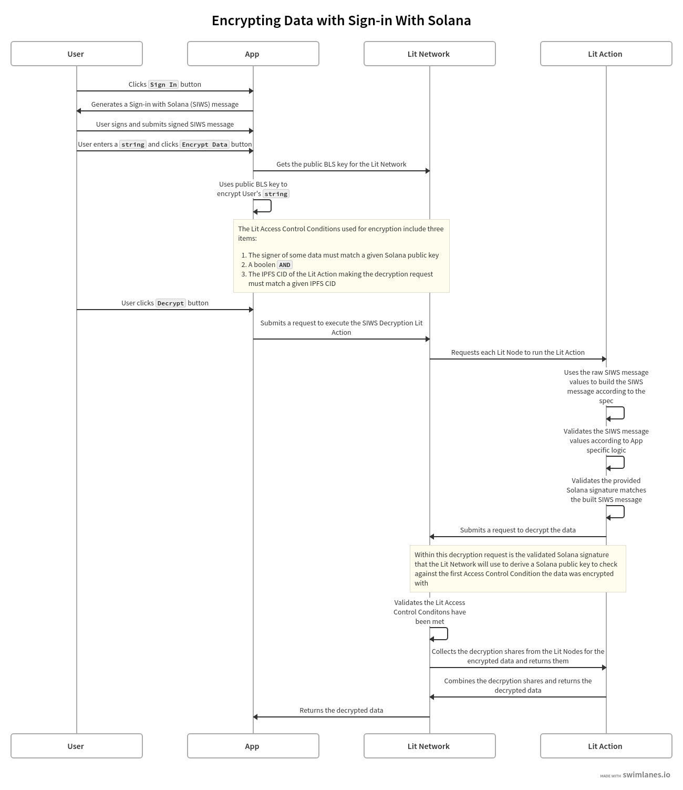

# Encrypting Data with Sign-in With Solana

This guide builds on the [Sign-in With Solana Access Control](./siws-access-control) guide to show how Lit Access Control Conditions, Sign-in With Solana (SIWS) messages, and Lit Actions can be used to encrypt and decrypt data based on authenticated Solana public keys.

## Prerequisites

Before continuing with this guide, make sure you have the following:

- An understanding of how the [Generating Session Signatures Using a SIWS Message](../../authentication/session-sigs/siws-pkp-session-sigs.md) guide works
- An understanding of how the [Sign-in With Solana Access Control](./siws-access-control) guide works
- An understanding of how [encrypting and decrypting data](../../../sdk/access-control/intro) with Lit Access Control Conditions works

## High Level Overview

The following diagram depicts the flow of encrypting and decrypting data based on Solana public keys using Sign-in With Solana (SIWS) messages and Lit Access Control Conditions:



:::info
A full implementation of this code example can be found [here](https://github.com/LIT-Protocol/developer-guides-code/tree/master/siws-encryption/browser).
:::

## Writing the Lit Action

The Lit Action used for this example does the following:

1. Parses the raw SIWS message values
2. Builds the SIWS message according to the SIWS specification
3. Validates that the provided Solana signature is valid for the SIWS message
4. Submits a decryption request to the Lit Network
    - The Lit Network handles validating the Lit Access Control Conditions, collecting the decryption shares from the Lit Nodes, and submitting them to the Lit Action
5. Combines the decryption shares and returns the decrypted data

For steps 1 - 3, we reuse the SIWS authentication logic from the [SIWS Authentication](../../authentication/authenticating-siws#parsing-and-re-building-the-siws-message) guide, so this guide will pick up from step 4.

:::info
The full implementation of this Lit Action can be found [here](https://github.com/LIT-Protocol/developer-guides-code/blob/master/siws-encryption/browser/src/litActions/litActionDecrypt.ts).
:::

### The Access Control Conditions

The Access Control Conditions used to encrypt the data for this example look like:

```ts
[
    {
      method: "",
      params: [":userAddress"],
      pdaParams: [],
      pdaInterface: { offset: 0, fields: {} },
      pdaKey: "",
      chain: "solana",
      returnValueTest: {
        key: "",
        comparator: "=",
        // This address would be the Solana public key that is authorized
        // to access the app, and you would replace it with the actual
        // public key that you want to be authorized to decrypt the data.
        value: address,
      },
    },
    { operator: "and" },
    {
      method: "",
      params: [":currentActionIpfsId"],
      pdaParams: [],
      pdaInterface: { offset: 0, fields: {} },
      pdaKey: "",
      chain: "solana",
      returnValueTest: {
        key: "",
        comparator: "=",
        // litActionCode is the stringified code for the SIWS Decrypt Lit Action
        value: await calculateLitActionCodeCID(litActionCode),
      },
    },
];
```

The first condition works that same way as in the [Sign-in With Solana Access Control](./siws-access-control#checking-the-access-control-conditions) guide. A Solana public key is derived from the provided signed SIWS message and compared to the public key specified as `address` in the Access Control Condition.

The second condition is a [boolean condition](../condition-types/boolean-logic) that states that both the first and third conditions must be met in order for decryption to be authorized.

The third condition verifies that the Lit Action executing the decryption request matches a specific IPFS CID. For this example, the expected CID corresponds to the SIWS Decrypt Lit Action's code, ensuring that only the authorized Lit Action can perform the decryption.

### Decrypting the Data

The above Access Control Conditions were created when the data was encrypted. They are provided to the Lit Action as a parameter of the Lit Action execution request, and are included in the Lit Action's decryption request to the Lit Network:

```ts
const decryptedData = await Lit.Actions.decryptAndCombine({
    // solRpcConditions are the above Access Control Conditions
    accessControlConditions: solRpcConditions,
    ciphertext,
    dataToEncryptHash,
    authSig: {
        sig: ethers.utils
            .hexlify(ethers.utils.base58.decode(_siwsObject.signature))
            .slice(2),
        derivedVia: "solana.signMessage",
        signedMessage: siwsMessage,
        address: siwsInput.address,
    },
    chain: "solana",
});
```

The `ciphertext` and `dataToEncryptHash` are generated when the data is encrypted, and are passed to the Lit Action as parameters for the Lit Action execution request.

The `authSig` object is what will be used by the Lit Network to validate the first Access Control Condition. It includes:

- `sig`: The provided, and now authenticated, Solana signature for the SIWS message
- `derivedVia`: The method used to derive the public key from the signature (`solana.signMessage` for SIWS messages)
- `signedMessage`: The authenticated SIWS message
- `address`: The Solana public key that we authenticated when the SIWS message was validated

The `chain` is set to `solana` to specify that the signature and public key are for the Solana blockchain.

When the Lit Network receives the decryption request, it validates the Access Control Conditions, and if they're met, it collects the decryption shares from the Lit Nodes and returns them to the Lit Action execution context.

The Lit Action then combines the decryption shares, decrypting the data, and returns the decrypted data to the frontend:

```ts
return LitActions.setResponse({ response: decryptedData });
```

## Summary

This guide demonstrates how to encrypt and decrypt data based on authenticated Solana public keys using Sign-in With Solana (SIWS) messages, Lit Actions, and Lit Access Control Conditions.

Key aspects of this implementation include:

- **SIWS Authentication**: Leverages the Sign-in With Solana specification to authenticate Solana wallet ownership.
- **Lit Actions**: Utilizes a custom Lit Action to parse and validate SIWS messages, and handle decryption requests.
- **Access Control Conditions**: Implements conditions to authorize specific Solana public keys and verify the Lit Action's integrity.
- **Encryption/Decryption Flow**: Demonstrates the process of encrypting data with Access Control Conditions and decrypting it using authenticated SIWS messages.

This approach provides a secure method for:

- **Encrypted Data Access**: Restricting decryption of sensitive information to specific Solana wallet owners.
- **Customizable Authorization**: Demonstrating how to define complex access control logic based on Solana public keys and other conditions.

By combining SIWS authentication with Lit Protocol's encryption capabilities, this implementation offers a robust solution for managing access to encrypted data in Solana-based applications.

:::info
A full implementation of this code example can be found [here](https://github.com/LIT-Protocol/developer-guides-code/tree/master/siws-encryption/browser).
:::
