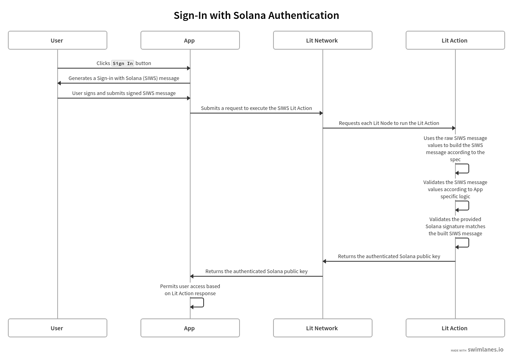

# Authenticating Sign-in With Solana Messages

Deriving a Solana public key (aka. address) from a signed message works slightly differently than when using Lit to authenticate signed messages on EVM chains.

Currently the Lit nodes support deriving an address from a Sign-in With Ethereum Message (EIP-5573), while also validating what was signed using the [EIP-5573 specification](https://eips.ethereum.org/EIPS/eip-5573) (e.g. the signed message hasn't expired and has the correct format).

However, the Lit nodes built-in support for authenticating signed Solana messages is limited to just deriving the Solana public key from the signed data, but they do **not** perform any validation on the what was signed. This means that any data signed by a specific Solana wallet will be accepted, which opens the door for signature malleability and replay attacks.

For example, if you had implemented access control that requires a message signed by a specific wallet to permit access, anyone could take any signed message from that specific wallet and use it to gain access, including all past transactions signed by the wallet. This is possible because the Lit nodes do not validate what was signed or when it was signed; they only validate that the data was signed by the specific wallet.

This guide covers how to authenticate SIWS messages using a Lit Action and the [SIWS specification](https://github.com/phantom/sign-in-with-solana/tree/main) created by Phantom.

## Prerequisites

Before continuing with this guide, make sure you have the following:

- An understanding of [Lit Actions](../serverless-signing/overview) and how they work
- A basic understanding of Phantom's [SIWS specification](https://github.com/phantom/sign-in-with-solana/tree/main)

## High Level Overview

Sign-in With Solana (SIWS) allows users to authenticate with applications by signing a standardized message using their Solana wallet. This signed message can then be verified by the app to authenticate the user securely.

The following diagram depicts the flow of authenticating SIWS messages using Lit Actions:



:::info
A full implementation of this code example can be found [here](https://github.com/LIT-Protocol/developer-guides-code/tree/master/siws-authentication/browser).
:::

## Writing the Lit Action

The Lit Action used for this example does the following:

1. Parses the raw SIWS message values
2. Builds the SIWS message according to the SIWS specification
3. Validates that the provided Solana signature is valid for the SIWS message
4. Returns the authenticated Solana public key

:::info
The full implementation of this Lit Action can be found [here](https://github.com/LIT-Protocol/developer-guides-code/blob/master/siws-authentication/browser/src/litActionSiwsAuth.ts).
:::

### Parsing and Re-building the SIWS Message

The SIWS message that the user signs has a specific structure defined by the SIWS specification. In this code example, the SIWS is built by the frontend and submitted to the user's wallet to prompt the user to sign the message.

At this point the frontend has the raw SIWS message and the user's signature of the message. The frontend could verify the signature itself, but for the sake of this example we'll assume that the frontend is untrusted and we're using Lit Actions as the backend to verify the SIWS message.

To verify the SIWS message within a Lit Action, the frontend needs to submit the raw SIWS message properties and the user's signature to the Lit Action. The Lit Action will then parse the raw SIWS message values and build the SIWS message according to the [Sign-In Input Fields specification](https://github.com/phantom/sign-in-with-solana/tree/main?tab=readme-ov-file#sign-in-input-fields).

An example of this is as follows:

```js
function getSiwsMessage(siwsInput) {
  let message = `${siwsInput.domain} wants you to sign in with your Solana account:\n${siwsInput.address}`;

  if (siwsInput.statement) {
    message += `\n\n${siwsInput.statement}`;
  }

  const fields = [];

  if (siwsInput.uri !== undefined) fields.push(`URI: ${siwsInput.uri}`);
  if (siwsInput.version !== undefined)
    fields.push(`Version: ${siwsInput.version}`);
  if (siwsInput.chainId !== undefined)
    fields.push(`Chain ID: ${siwsInput.chainId}`);
  if (siwsInput.nonce !== undefined) fields.push(`Nonce: ${siwsInput.nonce}`);
  if (siwsInput.issuedAt !== undefined)
    fields.push(`Issued At: ${siwsInput.issuedAt}`);
  if (siwsInput.expirationTime !== undefined)
    fields.push(`Expiration Time: ${siwsInput.expirationTime}`);
  if (siwsInput.notBefore !== undefined)
    fields.push(`Not Before: ${siwsInput.notBefore}`);
  if (siwsInput.requestId !== undefined)
    fields.push(`Request ID: ${siwsInput.requestId}`);
  if (siwsInput.resources !== undefined && siwsInput.resources.length > 0) {
    fields.push("Resources:");
    for (const resource of siwsInput.resources) {
      fields.push(`- ${resource}`);
    }
  }

  if (fields.length > 0) {
    message += `\n\n${fields.join("\n")}`;
  }

  return message;
}
```

:::info
During reconstruction of the SIWS message would be a good time to validate that the given message properties like `domain`, `chainId`, `expirationTime`, etc. conform to the requirements of your application.
:::

The output of this function is a string that represents the SIWS message that we're expecting the user to have signed:

```
localhost wants you to sign in with your Solana account:
5ZS9h2RYtKVnPM19JSdgKaEE4UJeSEQGgtwmfuFyqLan

URI: http://localhost:5173
Version: 1
Chain ID: 0
Nonce: 341972
Issued At: 2024-10-03T04:55:11.105Z
Expiration Time: 2024-10-03T05:05:11.105Z
```

### Validating the SIWS Message Signature

Now that we have the SIWS message, built according to the SIWS specification, we can validate is against the user's signature provided to the Lit Action:

```js
async function verifySiwsSignature(
  message,
  signatureBase58,
  publicKeyBase58
) {
  // Convert message to Uint8Array
  const messageBytes = new TextEncoder().encode(message);

  try {
    const signatureBytes = ethers.utils.base58.decode(signatureBase58);
    const publicKeyBytes = ethers.utils.base58.decode(publicKeyBase58);

    // Import the public key
    const publicKey = await crypto.subtle.importKey(
      "raw",
      publicKeyBytes,
      {
        name: "Ed25519",
        namedCurve: "Ed25519",
      },
      false,
      ["verify"]
    );

    // Verify the signature
    const isValid = await crypto.subtle.verify(
      "Ed25519",
      publicKey,
      signatureBytes,
      messageBytes
    );

    return isValid;
  } catch (error) {
    console.error("Error in verifySiwsSignature:", error);
    throw error;
  }
}
```

The result of this function is a boolean value indicating whether the signature provided to the Lit Action is for the SIWS message constructed using the provided SIWS message properties.

We then simply return the now authenticated Solana public key (aka. address) from the given SIWS message, which is a string, to the frontend:

```js
Lit.Actions.setResponse({ response: siwsInput.address });
```

## Summary

This guide demonstrates implementing Sign-in With Solana (SIWS) authentication using Lit Actions.

By implementing Phantom's SIWS specification, we have established a robust and secure method for verifying Solana wallet ownership. This authentication mechanism can be extended to authorize specific Solana public keys for various operations using Lit, such as:

- **Encrypted Data Access**: Restrict [decryption](../../sdk/access-control/intro) of sensitive information to specific Solana wallet owners.
- **Secure Session Management**: Generate [Session Signatures](../../sdk/authentication/session-sigs/get-lit-action-session-sigs) only for specific authenticated users.
- **Authorized PKP Signing**: Leverage [PKP Signing](../../user-wallets/pkps/quick-start#sign-a-transaction) to ensure only authenticated users can sign data and transactions with a specific PKP.

Key takeaways from this implementation are that the Lit Action:

- Reconstructs and verifies the SIWS message, ensuring the integrity of the signed data.
- Allows for custom validation of SIWS message properties to meet specific application requirements.
