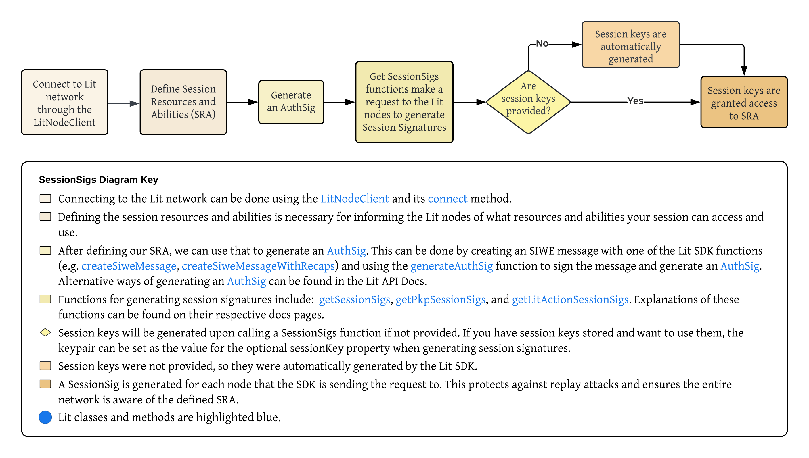

import FeedbackComponent from "@site/src/pages/feedback.md";

# Session Signatures

:::note

`SessionSigs` are only available on Ethereum and are heavily in development, so things may change. Be sure to use the latest version of the Lit JS SDK.

:::
Session signatures are how the Lit network authenticates your connection, verifies your identity, and confirms your capabilities. 

Generating session signatures is necessary whenever you want to request [Lit Abilities](https://v6-api-doc-lit-js-sdk.vercel.app/enums/types_src.LitAbility.html) (e.g., signing transactions with a particular PKP, executing a specified Lit Action) for your Lit Resources (e.g. PKPs, Lit Actions).

Session signatures are created with session keys, which are generated when you initiate a session through a request to a Lit network using the Lit SDK. Session keys are unique [`ed25519`](https://ed25519.cr.yp.to/) keypairs generated locally by the Lit SDK and are used to sign all requests to the Lit Network during the current session. 

While session signatures facilitate ongoing communication during a session, an `AuthSig` (Authentication Signature) is used to verify your identity and authorization to the Lit Nodes.

An `AuthSig` is an [ERC-5573](https://eips.ethereum.org/EIPS/eip-5573) Sign-In with Ethereum Capabilities message that specifies the Lit Resources and Lit Abilities of the session.

The `AuthSig` allows Lit Nodes to verify your authorization for requested actions, such as decrypting data, signing transactions with a PKP, or transferring PKP ownership. This ensures that only authorized users can perform specific actions within the Lit Network.
When you make a request, each Lit Node checks your `AuthSig` to confirm that your request aligns with the capabilities you previously defined. 

This authentication system enhances the security of the Lit network. For detailed explanations of this setup, please refer to our [Security Considerations](../security.md) page.

## SessionSigs Generation Diagram


## Paying for Usage of the Lit Network

You can facilitate payment for the Lit network within session signatures.

The correct code implementation will depend on whether you're using the free-to-use `datil-dev` network, or one of the "paid" networks: `datil` or `datil-test`.

Usage of the `datil` and `datil-test` networks require the use of [Lit Capacity Credits](../../../sdk/capacity-credits.md). Currently, Capacity Credits are paid for using the `tstLPX` token and don't require any real-world money. However, in the future you will need to pay real-world money for usage of Lit networks, and `datil` and `datil-test` are the Lit networks where this functionality is being tested and refined.

To implement payments correctly, include a [`capacityDelegationAuthSig`](https://developer.litprotocol.com/sdk/capacity-credits#createcapacitydelegationauthsig) within the `capabilityAuthSigs` array when generating session signatures.

## Storing `SessionSigs`

When running code to generate session signatures, you can store the session signatures and session keys using `LocalStorage` from the `node-localstorage` package.

```javascript
import { LocalStorage } from "node-localstorage";
```

When running code within a browser, this import is not needed, as the session signatures and keys will be stored within the browser's local storage. However, when running this code in an environment such as Node.js where browser local storage is not available, the `LocalStorage` module can be used to provide file-based storage. 

```javascript
litNodeClient = new LitNodeClient({
    litNetwork: LitNetwork.DatilDev,
    // This storageProvider object can be omitted if executing in a browser
    storageProvider: {
        provider: new LocalStorage("./lit_storage.db"),
    },
});
```
When a `storageProvider` is added to the `LitNodeClient` instance, all functions for generating session signatures will try to create a session keypair for you and store it in the local storage. 

The session keypair can also be generated with the `generateSessionKeyPair()` function. Doing this enables you to pass the generated session keypair as the optional `sessionKey` parameter when generating session signatures.

If an instance of `LocalStorage` is not provided as the `storageProvider`, a new session keypair will be generated each time the code runs, instead of reusing a single set of keys.

### Resources you can Request

You can pass an array of `resourceAbilityRequests` to any of the functions that generate session signatures. These will be presented to the user in the SIWE message - read more [here](resources-and-abilities) about Lit resources and abilities. The resources and abilities requested by the session key must be narrower or equal to the capabilities granted to it per the session capability object specified in the inner `AuthSig`. 

When session capability objects are omitted from functions generating session signatures, the SDK will generate a session capability object with **wildcard permissions against all of the resources in that category by default**, i.e. ability to perform operations against all access control conditions. This should only be done when debugging, as allowing unspecified access control conditions is a security vulnerability. Read more [here](capability-objects) about how to create custom session capability objects.

<FeedbackComponent/>
