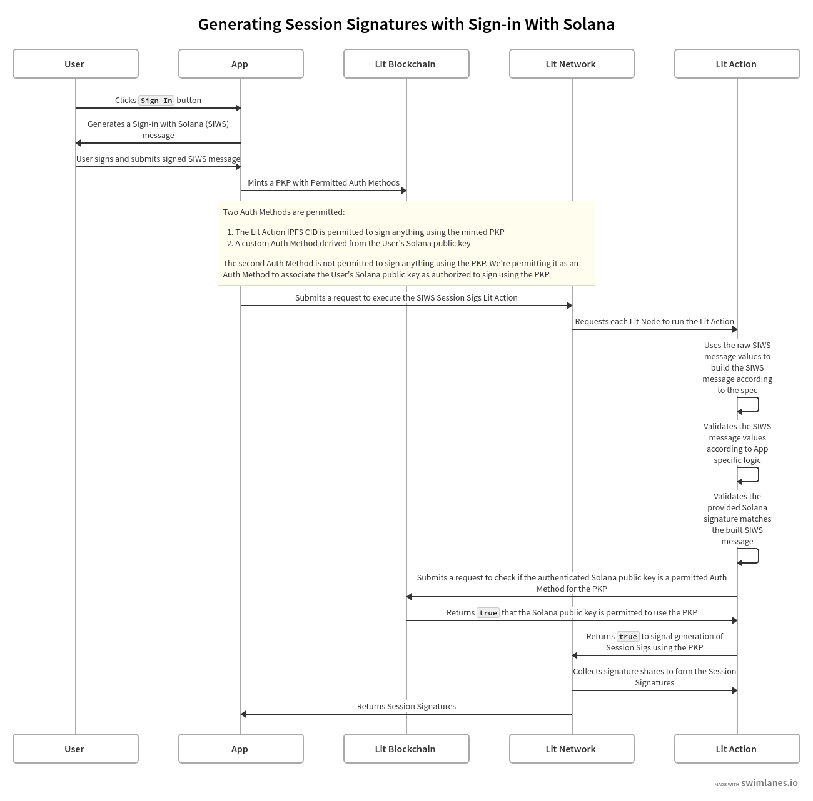

# Using a Sign-in With Solana Message

This guide builds on the [Sign-in With Solana Authentication](../authenticating-siws) guide to show how to use Lit Actions to generate PKP Session Signatures for an authorized Solana public key.

## Prerequisites

Before continuing with this guide, make sure you have the following:

- An understanding of how to generate Session Signatures [using a Lit Action](./get-lit-action-session-sigs)
- An understanding of how to [authenticate SIWS messages](../../authentication/authenticating-siws) using a Lit Action
- An understanding of [Authentication Methods](../../../user-wallets/pkps/advanced-topics/auth-methods/overview) and how the can be used to restrict PKP signing capabilities
  - You should also be familiar with [Custom Auth Methods](../../../user-wallets/pkps/advanced-topics/auth-methods/custom-auth)
- A basic understanding of Phantom's [SIWS specification](https://github.com/phantom/sign-in-with-solana/tree/main)

## High Level Overview

The following diagram depicts the flow of using a PKP to generate Session Signatures for an authorized Solana public key:



:::info
A full implementation of this code example can be found [here](https://github.com/LIT-Protocol/developer-guides-code/blob/master/siws-session-sigs/browser).
:::

## Minting the PKP with Permitted Auth Methods

In the complete implementation of this code example, there's a method called `mintPkpAndAddPermittedAuthMethods`. This method is responsible for minting a PKP and permitting the following PKP auth methods:

- The IPFS CID of the Lit Action that will be executed to authenticate the SIWS message and generate the Session Signatures
- The Solana public key that will be authorized to sign using the PKP

To add the Solana public key as a permitted Auth Method, we're going to use Custom Auth Methods. This just means we're going to define our own _Auth Method Type_ and _Auth Method ID_:

```ts
const authMethodType = ethers.utils.keccak256(
    // This can be anything, but should be unique to your app
    ethers.utils.toUtf8Bytes("Lit Developer Guide Solana SIWS Example")
);
const authMethodId = ethers.utils.keccak256(
    ethers.utils.toUtf8Bytes(`siws:${solanaPublicKey}`)
);
```

Then we utilize the [mintNextAndAddAuthMethods](https://v6-api-doc-lit-js-sdk.vercel.app/classes/contracts_sdk_src.LitContracts.html#pkpHelperContractUtil) from the `@lit-protocol/contracts-sdk` package to mint the PKP and add the permitted auth methods to the PKP:

```ts
const tx =
    await litContractsClient.pkpHelperContract.write.mintNextAndAddAuthMethods(
        AuthMethodType.LitAction, // keyType
        [AuthMethodType.LitAction, authMethodType], // permittedAuthMethodTypes
        [
        `0x${Buffer.from(
            ethers.utils.base58.decode(
            await calculateLitActionCodeCID(litActionSessionSigs)
            )
        ).toString("hex")}`,
        authMethodId,
        ], // permittedAuthMethodIds
        ["0x", "0x"], // permittedAuthMethodPubkeys
        [[AuthMethodScope.SignAnything], [AuthMethodScope.NoPermissions]], // permittedAuthMethodScopes
        true, // addPkpEthAddressAsPermittedAddress
        true, // sendPkpToItself
        { value: await litContractsClient.pkpNftContract.read.mintCost() }
);
const receipt = await tx.wait();
```

:::info
It's important to note that the first permitted Auth Method (the IPFS CID of the Lit Action) has the permission scope: `[AuthMethodScope.SignAnything]` which allows anything to be signed using the PKP, as long as the signing request is executed from within the Lit Action with the specific IPFS CID.

The second permitted Auth Method (our custom Auth Method) has the permission scope: `[AuthMethodScope.NoPermissions]` which grants no signing permissions. This is desired because this Auth Method is only used by the Lit Action to check if a Solana public key is authorized to sign using the PKP.
:::

At this point, we have minted a PKP that is only authorized to sign within a specific Lit Action, and can check if a derived Solana public key from a signed SIWS message is authorized to sign using the PKP.

## Writing the Lit Action

The Lit Action used for this example does the following:

1. Parses the raw SIWS message values
2. Builds the SIWS message according to the SIWS specification
3. Validates that the provided Solana signature is valid for the SIWS message
4. Builds our custom Auth Method Type and ID using the authenticated Solana public key
5. Makes a request to the Lit PKP permissions smart contract to check if the Auth Method Type and ID are permitted for the PKP
6. If permitted, returns the magic value, `"true"`, signalling the Lit network to generate Session Signatures using a given PKP
7. The Lit network returns the generated Session Signatures

For steps 1 - 3, we reuse the SIWS authentication logic from the [SIWS Authentication](../../authentication/authenticating-siws#parsing-and-re-building-the-siws-message) guide, so this guide will pick up from step 4.

:::info
The full implementation of this Lit Action can be found [here](https://github.com/LIT-Protocol/developer-guides-code/blob/master/siws-session-sigs/browser/src/litActionSessionSigs.ts).
:::

### Checking if the Solana Public Key is Authorized

First we generate the Custom Auth Method Type and ID using the authenticated Solana public key:

```ts
const SIWS_AUTH_METHOD_TYPE = ethers.utils.keccak256(
    ethers.utils.toUtf8Bytes("Lit Developer Guide Solana SIWS Example")
);
const usersAuthMethodId = ethers.utils.keccak256(
    ethers.utils.toUtf8Bytes(`siws:${solanaPublicKey}`)
);
```

Then we make a request to the Lit PKP permissions smart contract to check if the Auth Method Type and ID are permitted for the PKP:

```ts
return Lit.Actions.isPermittedAuthMethod({
    tokenId: pkpTokenId,
    authMethodType: SIWS_AUTH_METHOD_TYPE,
    userId: ethers.utils.arrayify(usersAuthMethodId),
});
```

If this contract call returns `true`, then we know that the Solana public key is authorized to sign using the PKP, and we can proceed to generate Session Signatures using the PKP.

### Generating Session Signatures

Now that we've checked the authenticated Solana public key is authorized to sign using the PKP, we simply return the following to signal the Lit network to generate Session Signatures using the PKP:

```ts
return Lit.Actions.setResponse({ response: "true" });
```

The Lit network will then generate Session Signatures for the PKP and return them to the frontend.

## Summary

This guide demonstrates how to leverage Phantom's Sign-in With Solana (SIWS) specification and Lit Actions to generate PKP Session Signatures using an authenticated SIWS message.

Key takeaways from this implementation are:

- The PKP is minted with specific permitted Auth Methods, including a Lit Action IPFS CID and a custom Auth Method for the Solana public key.
- The Lit Action reconstructs and verifies the SIWS message, ensuring the integrity of the signed data.
- The Lit Action checks if the authenticated Solana public key is authorized to use the PKP by querying the Lit PKP permissions smart contract.
- Upon successful authorization, the Lit Action signals the Lit network to generate Session Signatures for the PKP.

:::info
A full implementation of this code example can be found [here](https://github.com/LIT-Protocol/developer-guides-code/blob/master/siws-session-sigs/browser).
:::
