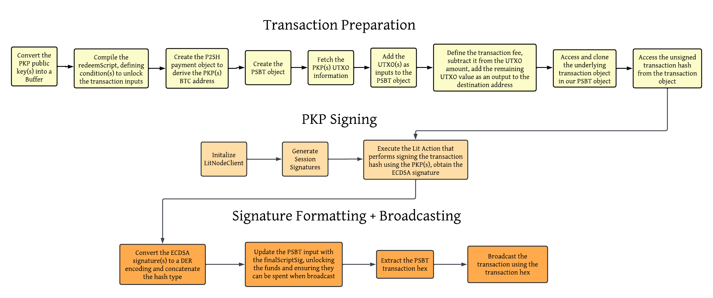

import Tabs from '@theme/Tabs';
import TabItem from '@theme/TabItem';

# Signing Bitcoin P2SH Transactions using a PKP

Signing Bitcoin transactions using a PKP works slightly differently than when using Lit to sign transactions on EVM chains.

The Lit nodes support PKP signing using the [ECDSA](link TBD) algorithm with it's private key share, which means PKPs can be used to sign transactions on the Bitcoin blockchain.

Due to the unique nature of PKPs and that we are unable to compile the private key in it's entirety, we must prepare the Bitcoin transaction to only require the PKP signature before signing it. Additionally, after obtaining the PKP signature, we will need to convert the standard ECDSA formatting to Bitcoin's [DER] format before finalizing and broadcasting the transaction.


## Prerequisites

Before continuing with this guide, make sure you have the following:

- An understanding of [Lit Actions](../../../sdk/serverless-signing/overview.md) and how they work
- A basic understanding of Bitcoin transactions, specifically [PSBTs](https://en.bitcoin.it/wiki/BIP_0174) and [scripts](https://en.bitcoin.it/wiki/Script)

## High Level Overview

Through specific preparation of the Bitcoin transaction, we can use a PKP to sign a Bitcoin transaction. 



### Signing Within a Lit Action

The following code snippet shows the `litActionCode` that will be executed to sign the transaction. It signs the data in the `toSign` variable and returns the ECDSA signature with the name `btcSignature`.

```tsx
// @ts-nocheck

const _litActionCode = async () => {
  try {
    const sigShare = await LitActions.signEcdsa({ toSign, publicKey, sigName: 'btcSignature' });
    Lit.Actions.setResponse({ response: 'true' });
  } catch (error) {
    Lit.Actions.setResponse({ response: error.message });
  }
};

export const litActionCode = `(${_litActionCode.toString()})();`;
```

### Formatting the Signature

Given an ECDSA signature from PKP signing, this function can help format the signature to be compatible with Bitcoin's [DER] format.
<details>
<summary>Click here to see how to format the signature</summary>
<p>

```tsx
import elliptic from "elliptic";
import * as bip66 from "bip66";
import * as bitcoin from "bitcoinjs-lib";
import BN from "bn.js";

function convertSignature(litSignature: any) {
    const EC = elliptic.ec;
    let r = Buffer.from(litSignature.r, "hex");
    let s = Buffer.from(litSignature.s, "hex");
    let rBN = new BN(r);
    let sBN = new BN(s);

    const secp256k1 = new EC("secp256k1");
    const n = secp256k1.curve.n;

    if (sBN.cmp(n.divn(2)) === 1) {
    sBN = n.sub(sBN);
    }

    r = rBN.toArrayLike(Buffer, "be", 32);
    s = sBN.toArrayLike(Buffer, "be", 32);

    function ensurePositive(buffer: any) {
    if (buffer[0] & 0x80) {
        const newBuffer = Buffer.alloc(buffer.length + 1);
        newBuffer[0] = 0x00;
        buffer.copy(newBuffer, 1);
        return newBuffer;
    }
    return buffer;
    }

    r = ensurePositive(r);
    s = ensurePositive(s);

    let derSignature;
    try {
    derSignature = bip66.encode(r, s);
    } catch (error) {
    console.error("Error during DER encoding:", error);
    throw error;
    }

    const signatureWithHashType = Buffer.concat([
    derSignature,
    Buffer.from([bitcoin.Transaction.SIGHASH_ALL]),
    ]);

    return signatureWithHashType;
}
```
</p>
</details>

### Broadcasting the Transaction

Using [mempoolJS] we could also broadcast the transaction to the network. Alternatively, you could take the transaction hex and broadcast it using a third party service or the [bitcoin-cli](https://developer.bitcoin.org/reference/rpc/sendrawtransaction.html). 
<details>
<summary>Click here to see how to broadcast the transaction</summary>
<p>

```tsx
import fetch from "node-fetch";

const broadcastTransaction = async (txHex: string, broadcastUrl: string) => {
    try {
    const response = await fetch(broadcastUrl, {
        method: "POST",
        headers: {
        "Content-Type": "text/plain",
        },
        body: txHex,
    });

    if (!response.ok) {
        const errorText = await response.text();
        throw new Error(`Error broadcasting transaction: ${errorText}`);
    }

    const txid = await response.text();
    console.log(`Transaction broadcasted successfully. TXID: ${txid}`);
    return txid;
    } catch (error: any) {
    console.error(error.message);
    }
};
```
</p>
</details>