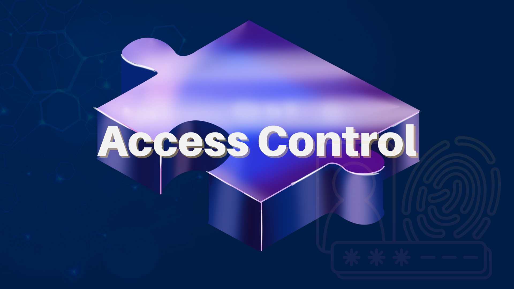

# 3. Access Control 


Lit Protocol provides developers with a decentralized access control layer that can be used to [encrypt](https://developer.litprotocol.com/resources/glossary#encryption) content for private and permissioned storage on the open web. The [Lit SDK](https://github.com/LIT-Protocol/js-sdk) provides utilities that can be used for encrypting and decrypting content client-side, while [access control conditions (ACCs)](https://developer.litprotocol.com/access-control/condition-types/unified-access-control-conditions) are used to define who can decrypt and access the locked data.

---

## Objectives
At completion of this reading you should be able to:

- Describe what access control conditions are useful for.
- List common types of applications that can be developed with access control.

---

With access control, you can introduce private and permissioned data to the open web using decentralized encryption. Use Lit to provision decryption "keys" to users based on on-chain conditions, such as ownership over a specific NFT or membership within a DAO.

Some example conditions: 
- User is a member of a DAO
- User holds an NFT in a collection
- User holds at least 0.1 ETH
- The result of any smart contract function call
- User owns a specific wallet address

## Supported Logic

- Supports many EVM chains and Solana. Full list [here](https://developer.litprotocol.com/support/supported-chains).
- Supports many standard contracts, with plans to support any RPC call soon. If you need to interact with a contract that we don't support yet, ask us, and we will implement it.
- *Boolean conditions*: "And" or "Or" are currently supported.
- *Permanent conditions*: When a condition is stored as permanent, it becomes impossible to update it, forever.

## Use Cases

Some examples of applications that can (and have) been built harnessing this functionality:

**Web3 Apps with Private Data**

Introduce privacy to decentralized applications. Use Lit to securely store private and permissioned data on the open web. To get started with an integration, use our JavaScript [SDK](https://developer.litprotocol.com/sdk/intro).

Examples:

- [Orbis Club](https://orbis.club/): Enabling “friends-only” content and encrypted messaging.
- [Lens](https://docs.lens.xyz/docs/gated): Permissioned data for web3 social.
- [Streamr](https://blog.streamr.network/streamr-integrates-lit-protocol/): Private data marketplaces.
- [Gather](https://www.gather.town/): Powering private virtual spaces for your team.

**Add Token Gating to Web2 Apps**

Use on-chain credentials to gate access to your favorite web2 applications and data.

- [Zoom](https://litgateway.com/apps/zoom): Token-gated Zoom calls.
- [Google Drive](https://litgateway.com/apps/google-drive): Add access control requirements to your Google Drive files.
- [WordPress](https://litgateway.com/apps/wordpress): Gate access to WordPress sites and pages.

---

## Basic Example

Restrict access based on the possession of an `ERC1155` token. In this example, the token contract's address is `0x3110c39b428221012934A7F617913b095BC1078C` and the token id we are checking for is `9541`.

```js
const accessControlConditions = [
  {
    contractAddress: '0x3110c39b428221012934A7F617913b095BC1078C',
    standardContractType: 'ERC1155',
    chain,
    method: 'balanceOf',
    parameters: [
      ':userAddress',
      '9541'
    ],
    returnValueTest: {
      comparator: '>',
      value: '0'
    }
  }
]
```


## Learn More
Read the [Lit developer docs](https://developer.litprotocol.com/access-control/intro#overview) on access control to learn more!
