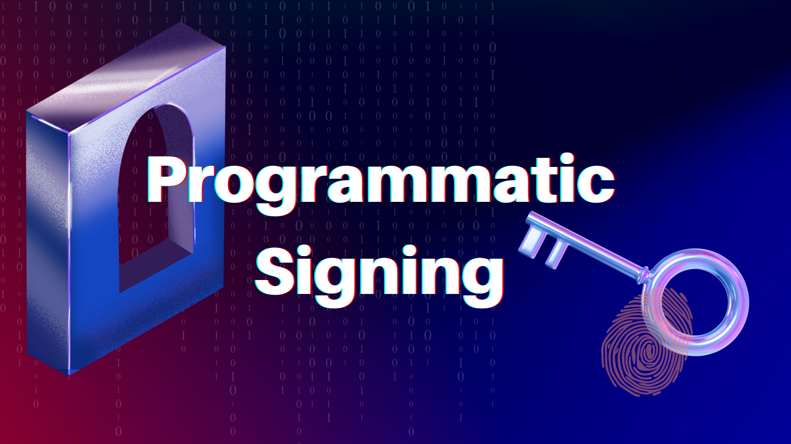

# 4. Programmatic Signing

As a distributed key management network, Lit provides developers with the ability to add programmable signing to their applications and wallets. These distributed wallets are known as Programmable Key Pairs (PKP) and the application logic that dictates when and why that key-pair will sign is known as a Lit Action.

---

## Objectives

At completion of this reading you should be able to:

- Explain how Lit Actions and Programmable Key Pairs (PKPs) work together.
- Summarize use cases for programmatic signing.

---

## Programmable Key Pairs

Each Programmable Key Pair (PKP) is a versatile multi-party computation wallet that can be utilized by developers to:

- Provide users of web3 with seamless, "seed-phraseless" onboarding experiences.
- Facilitate transaction execution on blockchains, storage networks, and other state machines.
- Build fully decentralized application backends.

**Features**

1. [Blockchain Agnostic](../../v3/resources/supported-chains): PKPs can be used to sign transactions on any blockchains or state machines using [ECDSA](https://blog.cloudflare.com/ecdsa-the-digital-signature-algorithm-of-a-better-internet/) for digital signatures. Currently, the [SDK](https://github.com/LIT-Protocol/js-sdk/tree/master/packages/pkp-client) provides easy-to-use methods for creating wallets on EVM and Cosmos based chains.
2. Programmable: Lit Actions contain the application logic that each PKP should follow. This is useful for defining [signing automations](../../v3/sdk/wallets/intro), handling authentication, or generating conditional proofs.
3. Fault-tolerant: Each PKP is generated collectively by the Lit nodes through a process called [Distributed Key Generation](https://en.wikipedia.org/wiki/Distributed_key_generation) (DKG). As a network, this allows Lit to generate a new key-pair where the private key never exists in its entirety.
4. Interoperable: Use [WalletConnect](https://github.com/LIT-Protocol/pkp-walletconnect) to connect PKPs to your favorite dApps, just like any other EOA wallet.

## Lit Actions

Lit Actions are JavaScript programs that can be used to specify signing and authentication logic for PKPs. When used in conjunction with PKPs, Lit Actions are functionally serverless functions with their own private key-pair. Together these tools can be used to write data to blockchains and other state machines.

Every Lit Action gets executed across Lit’s threshold cryptography network in parallel, meaning the result of each program is independently verified by each node. Once a threshold of nodes have verified the result (more than two-thirds of network participants), the signing or decryption logic defined therein can be executed.

Lit Actions are stored on the InterPlanetary File System (IPFS).

**Features**

1. [Blockchain Agnostic](../../v3/resources/supported-chains): Lit Actions can be used to write data to blockchains using PKPs
2. Immutable: Once a Lit Action has been published, it cannot be modified
3. Atomicity: Using Mint/Grant/Burn, you can atomically link a PKP to an authorized set of Lit Actions. This method guarantees that a particular PKP can only ever be used to sign data from within the approved set
4. Off-Chain Compatibility: Lit Actions can pull in data from [off-chain sources](../../v3/sdk/access-control/lit-action-conditions) natively, without requiring the use of a third party oracle

## How do Lit Actions and PKPs work together?

A user can create a new PKP and grant a Lit Action the right to sign using it. This means the distributed key has the ability to sign and decrypt arbitrary data based on pre-defined logic and conditions.

## Why is this useful?

A programmable distributed key is a primitive with a number of potential use cases. For example, using a PKP and Lit Actions for onboarding web2 users to wallets based on modern multi-factor authentication (withouth relying on a central authority or key custodian).

Additionally, Lit Actions + PKPs + web3 storage can be a replacement for a traditional web2 backend. Consider a web3-based Twitter alternative that utilizes [Ceramic](https://ceramic.network/) as its data storage solution. By creating a PKP associated with a Ceramic stream and granting specific Lit Actions the capability to sign with that PKP, you can emulate the functionality of a web2 backend. The Lit Actions can enforce business logic to ensure that only accurate data is written to the Ceramic stream. A `likePost()` Lit Action could verify whether a user has already liked a post before allowing the like to be recorded in the stream.

With Lit and web3 storage like Ceramic, you can empower Lit Actions to assume an "admin mode" role over a Ceramic stream. This is achieved by granting the Lit Action the ability to sign with the PKP associated with the stream. Nonetheless, it is crucial to note that the Lit Action will strictly adhere to the logic implemented within its code, ensuring that data is written to the stream in accordance with the specified rules.

This seamless transition from a centralized web2 model to a decentralized web3 paradigm is greatly simplified through the capabilities provided by Lit.

## Use Cases

Automation and interoperability to the dWeb with Lit Actions and PKPs.

Below you will find some example projects and other potential ideas and use cases.

**DeFi Automation**

Use PKPs and Actions to automate your interactions across decentralized finance.

- Condition-based transactions (ex. on-chain limit orders).
- Recurring payments.

Example Projects:

- [Sling Protocol](https://github.com/Sling-Protocol/pkp-dex-sdk): An SDK for automating transactions on popular DEXs. Currently supports Uniswap V3 and 1inch.

**Infrastructure**

Build powerful infrastructure that harnesses the power of Lit!

- Cross-chain bridges.
- Event listening and condition-based execution.
- Privacy-preserving transactions.
- Decentralized key custodians.

Example Projects:

- [Yacht Labs](https://yachtlabs.io/blog/yacht-lit-swap): Cross-chain atomic swaps with PKPs and Lit Actions
- [Curve Labs](https://github.com/Curve-Labs/lit-privacy/tree/main): SDK for building privacy-preserving interactions on-chain

**Web3 Social**

Social applications that empower users with privacy and true data ownership.

- Credentialing systems for privacy-preserving web3 login.
- Account abstraction with support for web2 auth methods (i.e. Apple Passkey).
- Verifiable, on-chain reputation building.

Example Projects:

- [Krebit](https://spark.litprotocol.com/krebitxlitactions/): Automated Verifiable Credential issuance.
- [Wallet Abstraction demo](https://spark.litprotocol.com/wallet-abstraction-with-google-oauth/): Using Google oAuth to create a Lit MPC wallet.

**Gaming**

Improve the state of [web3 gaming](https://spark.litprotocol.com/lit-and-web3-gaming/).

- Signing and wallet abstraction for blockchain-based games.
- Condition-based reward systems and achievements.
- Private data for multiplayer games.

---

## Learn More

Read the Lit developer docs on [programmatic signing](https://developer.litprotocol.com/v3/sdk/wallets/intro).

In order to utilize the Lit functions for PKPs and Lit Actions, you'll need the [Lit JS SDK](https://github.com/LIT-Protocol/js-sdk).
