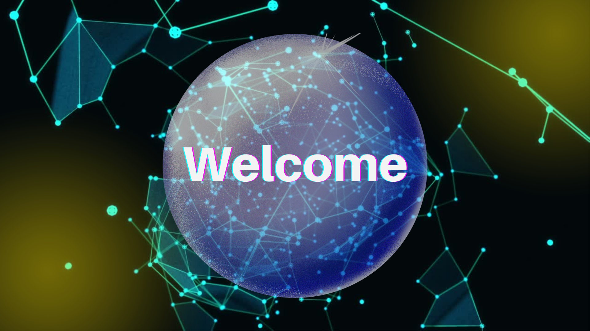

Welcome to the beginning of your journey into the world of Lit! This 'Introduction to Lit' module is your first step towards gaining a high level understanding of Lit's encryption, access control, and programmatic signing capabilities.

In this course, you'll learn about the basics of Lit, its architecture, and the technology behind it. We will also explore the role and significance of Lit in the broader context of the decentralized web, highlighting its applications and potential for creating a more secure and private digital space.

By the end of this lesson, you will have a solid foundation in understanding Lit Protocol, setting you up for success in our more advanced, coding focused modules.

Remember, your learning journey is not a race! Take your time and enjoy the process.

At the close of this module, you'll complete a quiz to confirm your grasp of the concepts. Successfully completing it will earn you a proof of knowledge credential, a testament to your growing proficiency in the Lit universe!

Let's get started!
